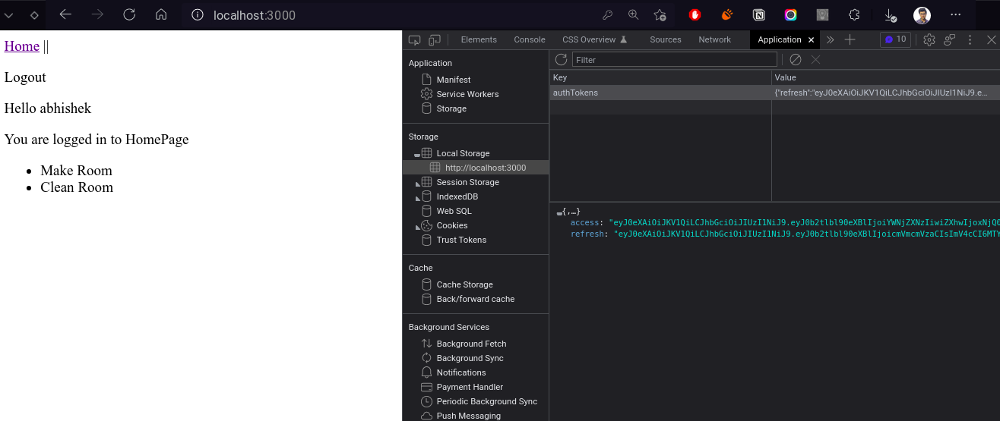

# Task of Toddle
# Django JWT Authentication with survey

## Technologies:

> Backend:
  - Django
  - djangorestframework
  - django-cors-headers
  - djangorestframework-simplejwt

## Storing temporary in localstorage

## JWT Token Configuration

<code>

    {
      'ACCESS_TOKEN_LIFETIME': timedelta(minutes=5),
      'REFRESH_TOKEN_LIFETIME': timedelta(days=10),
      'ROTATE_REFRESH_TOKENS': True,
      'BLACKLIST_AFTER_ROTATION': True,
      'UPDATE_LAST_LOGIN': False,

      'ALGORITHM': 'HS256',
      'SIGNING_KEY': SECRET_KEY,
      'VERIFYING_KEY': None,
      'AUDIENCE': None,
      'ISSUER': None,
      'JWK_URL': None,
      'LEEWAY': 0,

      'AUTH_HEADER_TYPES': ('Bearer',),
      'AUTH_HEADER_NAME': 'HTTP_AUTHORIZATION',
      'USER_ID_FIELD': 'id',
      'USER_ID_CLAIM': 'user_id',
      'USER_AUTHENTICATION_RULE': 'rest_framework_simplejwt.authentication.default_user_authentication_rule',

      'AUTH_TOKEN_CLASSES': ('rest_framework_simplejwt.tokens.AccessToken',),
      'TOKEN_TYPE_CLAIM': 'token_type',
      'TOKEN_USER_CLASS': 'rest_framework_simplejwt.models.TokenUser',

      'JTI_CLAIM': 'jti',

      'SLIDING_TOKEN_REFRESH_EXP_CLAIM': 'refresh_exp',
      'SLIDING_TOKEN_LIFETIME': timedelta(minutes=5),
      'SLIDING_TOKEN_REFRESH_LIFETIME': timedelta(days=1),
      
    }

</code>

# for testing purpose 
id -test
pass -test123

go to admin pannel for more details
--- 